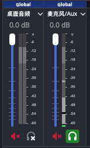
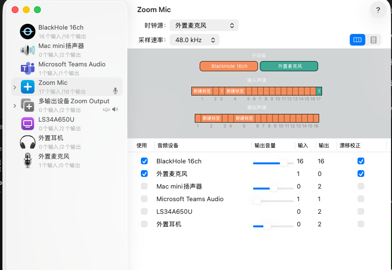
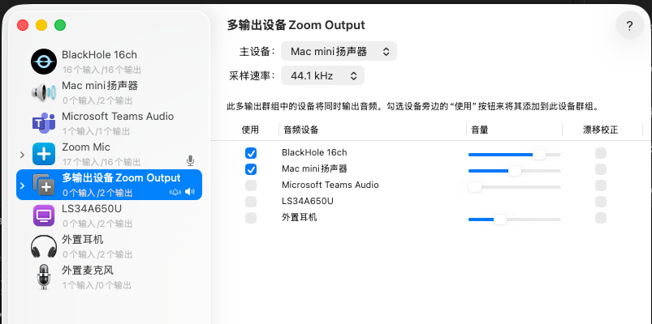
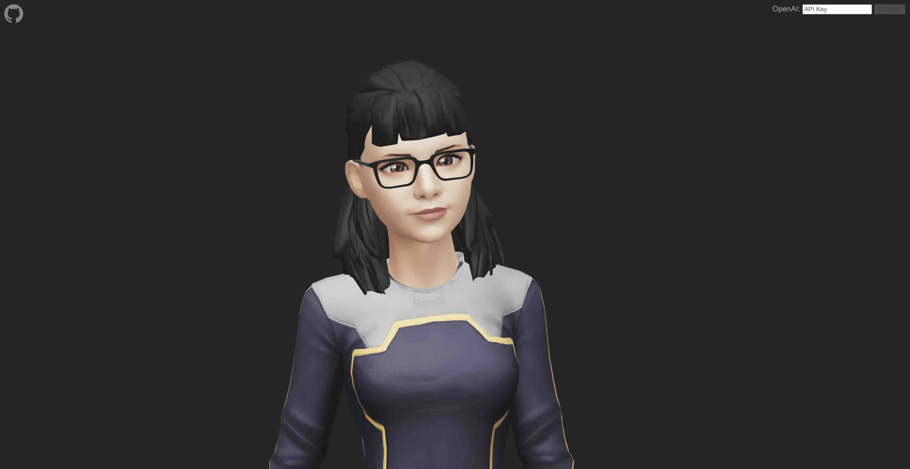
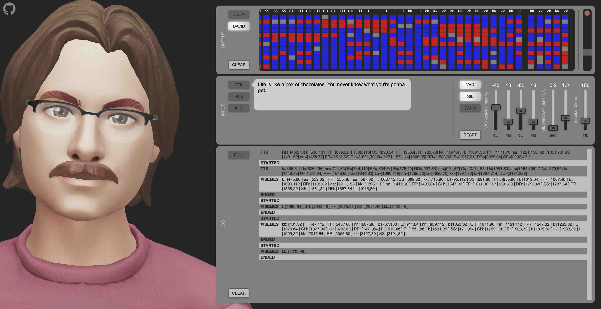
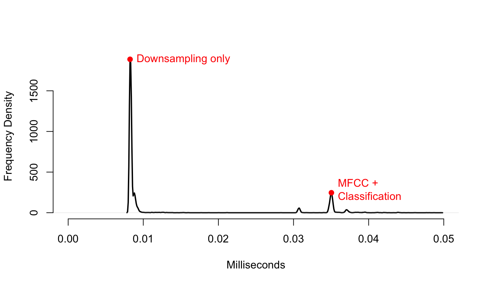
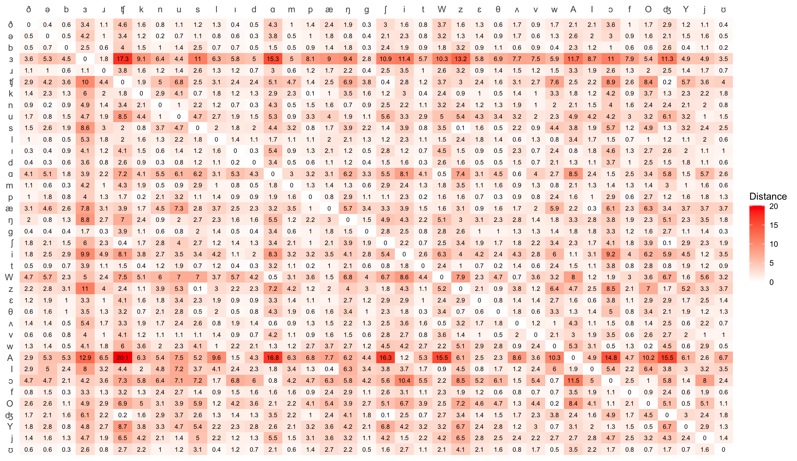

# HeadAudio

---

### Quick Start / 快速开始

Qwen3-ASR 离线语音识别 + Chrome TTS + 3D 虚拟头像口型同步，全部在本地运行。

#### 前置条件

- macOS (Apple Silicon)
- [uv](https://docs.astral.sh/uv/) Python 包管理器
- OBS Studio (macOS 版)

#### 1. 安装依赖

```bash
uv sync
```

#### 2. 下载 Qwen3-ASR 模型

ASR 后端使用 [Qwen3-ASR-1.7B-MLX-4bit](https://huggingface.co/) 模型（Apple Silicon MLX 4-bit 量化），需提前下载到本地：

```bash
# 安装 huggingface-cli（如未安装）
uv pip install huggingface_hub

# 下载模型（约 1GB）
huggingface-cli download Qwen/Qwen3-ASR-1.7B-MLX-4bit --local-dir ~/.cache/huggingface/hub/Qwen3-ASR-1.7B-MLX-4bit
```

> 模型默认路径配置在 `qwen3_asr_wrapper.py` 的 `ASR_MODEL_PATH` 变量中，可按需修改。

#### 2.1 下载 Parakeet-MLX 模型（英文 ASR 可选）

如果使用 Parakeet 方案（低延迟英文识别），需额外下载 MLX 格式模型：

```bash
# 下载模型（约 2.5GB）
huggingface-cli download mlx-community/parakeet-tdt-0.6b-v3
```

> 模型自动缓存到 `~/.cache/huggingface/hub/`，`parakeet_asr_server.py` 会自动加载。如网络不通，可手动指定本地路径。

#### 2.2 安装 oMLX LLM 推理服务（知识库 RAG 需要）

知识库问答依赖本地 LLM 推理服务 [oMLX](https://github.com/omlx-runtimme/omlx)（Apple Silicon 优化），通过 OpenAI 兼容 API 提供文本生成。

**1) 安装 oMLX：**

```bash
# Homebrew 安装（推荐）
brew install omlx

# 或通过 pip
pip install omlx
```

**2) 下载模型：**

```bash
# 推荐使用 Qwen3.5-2B（轻量、响应快、无 thinking 干扰，约 2GB）
omlx pull Qwen3.5-2B-MLX-8bit

# 也可下载更大模型获得更好质量（但会产生 thinking process）
# omlx pull Qwen3.5-9B-MLX-4bit    # ~5GB
# omlx pull Qwen3.5-27B-MLX-4bit   # ~15GB
```

**3) 启动服务：**

```bash
omlx serve --model Qwen3.5-2B-MLX-8bit --port 12345
```

**4) 验证服务：**

```bash
curl -s http://127.0.0.1:12345/v1/models \
  -H "Authorization: Bearer 1234" | python3 -m json.tool
```

> 默认 API Key 为 `1234`，配置文件位于 `~/.omlx/settings.json`。如需修改 Key 或模型选择，编辑 `knowledge_base.py` 顶部的 `DEFAULT_LLM_KEY` 和 `DEFAULT_MODEL` 常量。

#### 2.3 安装 Python 依赖（知识库 RAG 需要）

```bash
pip install httpx
```

> `httpx` 用于调用 oMLX 的 OpenAI 兼容 API。其余依赖（`sqlite3`、`re`）为 Python 标准库，无需额外安装。

#### 2.4 知识库数据

知识库使用 SQLite + FTS5 存储，数据文件为项目根目录的 `knowledge.db`：

- **首次启动** `parakeet_asr_server.py` 时，如果数据库为空，会自动注入演示数据（3 场英文模拟会议）
- **手动测试**：`python3 knowledge_base_demo.py`（交互式问答）
- **自定义数据**：通过 `KnowledgeBase` API 导入自己的会议记录或文档

```python
from knowledge_base import KnowledgeBase

kb = KnowledgeBase()

# 添加会议记录
kb.add_meeting_transcript(
    turns=[{"role": "Alice", "content": "We need to ship by Friday."}],
    session_id="standup-apr7",
    meeting_title="Daily Standup - April 7"
)

# 添加文档
kb.add_document("Product specs: feature A supports X and Y.", filename="specs.txt")

# 查询
print(kb.query("When do we need to ship?"))
```

#### 3. 启动 OBS (释放浏览器媒体权限)

OBS 需要以特殊参数启动，解除 Chrome 内核对自动播放和麦克风的限制：

```bash
chmod +x start_obs.sh
./start_obs.sh
```

> 如果 OBS 已经在运行，先完全退出 (`Command+Q`) 再执行脚本。

脚本通过 `--use-fake-ui-for-media-stream` 等参数，让 OBS 内嵌浏览器面板跳过媒体权限弹窗和自动播放限制，TTS 音频可无需用户点击即播放。

#### 3.1 OBS 音频配置（避免回声）

在 OBS 中需正确配置音频监听模式，否则 TTS 播放的音频会通过麦克风回路产生回声。请按以下截图配置：



**关键设置：**
- 在 OBS 的 `高级音频属性` 中，将浏览器源的 **音频监听** 模式设置为仅监听（Monitor Only），不要选择「监听并输出（Monitor and Output）」
- 确保麦克风源的音频监听设为关闭（None），避免麦克风采集的声音再次从扬声器输出形成回路
- 如使用耳机，可适当放宽上述限制，但建议保持一致以获得最佳效果

#### 3.2 macOS 音频路由配置（BlackHole）

若需将系统音频（如 TTS 输出）同时路由到 OBS 和扬声器，推荐安装 [BlackHole](https://existential.audio/blackhole/) 虚拟音频驱动，配合 macOS 自带的「音频 MIDI 设置」创建多输出设备。

**1) 安装 BlackHole**

```bash
# 推荐使用 Homebrew 安装
brew install blackhole-16ch
```

**2) 创建多输出设备（Multi-Output Device）**

打开「音频 MIDI 设置」（Audio MIDI Setup），点击左下角 `+` → 「创建多输出设备」，勾选：
- 扬声器 / 耳机（物理输出）
- BlackHole 16ch

将此多输出设备重命名为 `Multi-Output`，然后将系统默认输出设为该设备。

**3) 配置麦克风聚合（Aggregate Device）**



创建聚合设备（Aggregate Device），勾选：
- Mac 内置麦克风（或外接麦克风）
- BlackHole 16ch

这样 OBS 可以从该聚合设备采集到麦克风输入，同时 BlackHole 通道用于内部音频路由。

**4) 系统音频输出配置**



确保多输出设备中主设备（Master Device）设为物理扬声器/耳机，BlackHole 作为从设备。这样系统声音既能从扬声器听到，也能被 OBS 通过 BlackHole 采集到。

> **提示：** 配置完成后，在 OBS 的音频设置中将麦克风输入选为刚创建的聚合设备，即可实现麦克风 + 系统音频的同时采集。

#### 4. 启动后端服务

```bash
uv run python voice-asr-server.py
```

服务器监听 `ws://localhost:8765`，提供 Qwen3-ASR 离线语音识别。

#### 5. 启动前端 (HTTP)

```bash
uv run python -m http.server 8000
```

浏览器打开 `http://localhost:8000/voice-asr.html`。

> 必须通过 HTTP 服务访问，直接以 `file://` 打开会导致 WebSocket 和模块加载失败。

#### 演示流程

```
终端 1: uv run python voice-asr-server.py   # ASR 识别服务
终端 2: ./start_obs.sh                       # 启动 OBS (可选)
终端 3: uv run python -m http.server 8000    # 前端 HTTP 服务
浏览器:  http://localhost:8000/voice-asr.html
```

页面加载后，语音检测默认自动开启，对麦克风说话即可触发 ASR 识别 → Chrome TTS 朗读 → HeadAudio 驱动口型同步。点击麦克风按钮可切换检测开关状态。

---

### Zoom 会议助手 Demo

本 Demo 集成了 Zoom Meeting SDK，实现会议字幕实时捕获、缓存和 AI 问答功能。数字人会通过系统语音（TTS）回答会议相关问题。

**功能特点：**
- **实时字幕缓存**：收到字幕立即存入内存，避免数据库写入延迟
- **唤醒词触发**：支持 "hey echo", "echo", "Aiko", "mike", "mac", "mic" 等唤醒词
- **广播机制**：答案广播给所有连接的客户端（数字人、Web 界面等）
- **系统语音回答**：使用浏览器内置 TTS 播放答案，数字人同步口型
- **无 STT 依赖**：不使用语音识别，直接从 Zoom 字幕获取文本

#### 架构说明

```
┌─────────────────────────────────────────────────────────────────┐
│  web-demo.html (Zoom Meeting SDK)                              │
│  ┌─────────────────────────────────────────────────────────┐   │
│  │ Zoom SDK → 获取字幕                                      │   │
│  │     ↓                                                    │   │
│  │  ├─→ HTTP API → captions.db (数据库)                     │   │
│  │  └─→ WebSocket → zoom_captions_server.py → 内存缓存       │   │
│  └─────────────────────────────────────────────────────────┘   │
└─────────────────────────────────────────────────────────────────┘
                            ↓
┌─────────────────────────────────────────────────────────────────┐
│  zoom_captions_server.py (ws://localhost:8767)                  │
│  ┌─────────────────────────────────────────────────────────┐   │
│  │ 收到 caption 事件 → 添加到内存缓存 (CaptionCache)        │   │
│  │     ↓                                                    │   │
│  │  检测唤醒词 → 从缓存获取上下文 → LLM 生成答案            │   │
│  │     ↓                                                    │   │
│  │  广播答案给所有连接的客户端                              │   │
│  └─────────────────────────────────────────────────────────┘   │
└─────────────────────────────────────────────────────────────────┘
                            ↓
┌─────────────────────────────────────────────────────────────────┐
│  voice-asr-parakeet.html (数字人查询端)                         │
│  连接 WebSocket → 接收答案 → Chrome TTS 朗读 → 口型同步       │
└─────────────────────────────────────────────────────────────────┘
```

#### 使用步骤

**0. 启动LLM服务，确保LLM在后端服务之间已经就位。否则回答内容重复听到的话。

**1. 启动后端服务 (zoom_captions_server.py)**

```bash
# 终端 1: 启动 Zoom 字幕服务
uv run python zoom_captions_server.py
```

服务监听 `ws://localhost:8767`，提供：
- 字幕缓存（最多 200 条）
- 唤醒词检测
- LLM 问答（需 oMLX 服务运行）
- 答案广播

**2. 启动 Zoom Bot 前端 (web-demo.html)**

```bash
# 终端 2: 启动 zoom-meeting-sdk-demo 的 web 服务器
cd /Volumes/sn7100/jerry/code/zoom-meeting-sdk-demo
node web-server.js 8080
```

浏览器打开 `http://localhost:8080/web-demo.html`

**重要：手动开启字幕功能**

加入 Zoom 会议后，需要**手动启用字幕**：
1. 在 Zoom 会议中，点击 "Live Transcript" 或 "CC" 按钮
2. 选择 "Enable Auto-Transcription" 或请求主持人开启
3. 确认字幕开始显示

**3. 启动数字人前端 (voice-asr-parakeet.html)**

```bash
# 终端 3: 启动 HeadAudio HTTP 服务
uv run python -m http.server 8000
```

浏览器打开 `http://localhost:8000/voice-asr-parakeet.html`

**4. 启动 OBS（可选，用于直播/录制）**

```bash
# 终端 4: 启动 OBS
chmod +x start_obs.sh
./start_obs.sh
```

在 OBS 中添加浏览器源：
- URL: `http://localhost:8000/voice-asr-parakeet.html`
- 宽度: 1920, 高度: 1080

#### 完整启动流程

**启动顺序：**

```bash
# === 终端 1: 启动应答服务 ===
python3 zoom_captions_server.py
# 监听 ws://localhost:8767

# === 终端 2: 启动 Zoom SDK 字幕捕获服务 ===
cd /Volumes/sn7100/jerry/code/zoom-meeting-sdk-demo
node web-server.js 8080
# 访问 http://localhost:8080/web-demo.html

# === 终端 3: 启动数字人 Web 服务 ===
# 使用 Live Server 或 Python HTTP Server
uv run python -m http.server 8000
# 或在 VS Code 中使用 "Live Server" 打开 voice-asr-parakeet.html
# 访问 http://127.0.0.1:5500/voice-asr-parakeet.html (Live Server)
# 或 http://localhost:8000/voice-asr-parakeet.html (Python)

# === 终端 4: 带参数启动 OBS ===
chmod +x start_obs.sh
./start_obs.sh

# === 步骤 5: 在 OBS 中启动虚拟摄像头 ===
# OBS 菜单: 文件 → 设置 → 视频
# 或者使用 OBS 插件 "Virtual Cam" 输出虚拟摄像头

# === 步骤 6: 通过 localhost:8080 加入 Zoom 会议 ===
# 浏览器访问 http://localhost:8080/web-demo.html
# 输入会议号和密码加入会议

# === 步骤 7: 确保字幕功能已开启 ===
# Host 端: 在 Zoom 中开启 "Live Transcript" / "CC"
# Bot 端: 确认字幕显示正常
```

**重要提示：**
1. 所有服务必须按顺序启动，确保依赖关系正确
2. OBS 需要先完全退出 (`Command+Q`) 再用脚本启动
3. 虚拟摄像头需要在 OBS 设置中配置
4. 会议 Host 和 Bot 端都必须开启字幕功能（待确认）

#### 测试唤醒词

**方式 1：通过 Zoom 字幕触发**

1. 加入 Zoom 会议
2. 确保字幕已启用
3. 有人说话包含唤醒词，例如：
   - "Hey echo，今天会议讨论了什么？"
   - "Mike，总结一下刚才的内容"
4. 数字人会自动回答问题

**方式 2：手动查询**

在 `voice-asr-parakeet.html` 的输入框中输入：
- "echo 今天天气怎么样"
- "Aiko 会议中有哪些决定"

#### 配置说明

**唤醒词列表** (`zoom_captions_server.py`):
```python
TRIGGER_WORDS = ["hey echo", "echo", "Aiko", "mike", "mac", "mic"]
```

**缓存大小** (`zoom_captions_server.py`):
```python
caption_cache = CaptionCache(max_size=200)  # 最多缓存 200 条字幕
```

**LLM 配置** (`zoom_captions_server.py`):
```python
LLM_API_BASE = "http://127.0.0.1:12345/v1"  # oMLX 服务地址
LLM_MODEL = "Qwen3.5-2B-MLX-8bit"            # 模型名称
```

#### 注意事项

1. **字幕延迟**：Zoom 字幕可能有 2-5 秒延迟，属正常现象
2. **唤醒词检测**：字幕中的唤醒词会自动触发，无需手动操作
3. **多客户端**：答案会广播给所有连接的客户端，包括 Web 界面和数字人
4. **TTS 语音**：使用浏览器内置 TTS（Chrome 的 "Samantha" 或 "Google" 语音）
5. **数据库路径**：`/Volumes/sn7100/jerry/code/zoom-meeting-sdk-demo/captions.db`

#### 相关文件

| 文件 | 说明 |
|------|------|
| `zoom_captions_server.py` | 后端服务，缓存+LLM 问答 |
| `voice-asr-parakeet.html` | 数字人查询前端 |
| `/Volumes/sn7100/jerry/code/zoom-meeting-sdk-demo/web-demo.html` | Zoom Bot 前端 |

#### 技术架构

**方案 A — Qwen3-ASR（中文/多语言）：**

```
浏览器 (前端)                         Python (后端)
┌─────────────┐    WebSocket    ┌──────────────────┐
│ TalkingHead │◄──────────────►│ voice-asr-server │
│  3D 头像     │   JSON/Base64  │   Qwen3-ASR      │
│ HeadAudio   │                 │   (MLX GPU 加速)  │
│  口型同步    │                 └──────────────────┘
│ Chrome TTS  │
│  语音合成    │
└─────────────┘
```

**方案 B — Parakeet + Knowledge Base RAG（英文 + 问答）：**

```
浏览器 (前端)                               Python (后端)
┌──────────────┐    WebSocket     ┌─────────────────────────┐
│ TalkingHead  │                  │ parakeet_asr_server.py   │
│  3D 头像      │◄──────────────►│   ├── Parakeet ASR       │
│ HeadAudio    │   JSON/Base64   │   └── Knowledge Base RAG  │
│  口型同步     │                  │       ├── SQLite FTS5    │
│ Chrome TTS   │                  │       └── oMLX LLM       │
│  朗读答案     │                  │         (Qwen3.5-2B)     │
└──────────────┘                  └─────────────────────────┘
```

- **HeadAudio**: 浏览器 AudioWorklet，实时分析音频 MFCC 特征 → 马氏距离分类 → 输出 Oculus viseme 口型参数
- **TalkingHead**: Three.js 3D 头像渲染，接收 viseme 值驱动 blend shape
- **Qwen3-ASR**: Apple Silicon MLX 加速的离线语音识别，浏览器录音经 WebSocket 发送至后端
- **Chrome TTS**: 浏览器内置语音合成，将识别结果朗读出来

#### ASR 后端切换

项目提供两套独立的 ASR 后端，可随时切换：

| | Qwen3-ASR (方案A) | Parakeet-MLX (方案B) |
|---|---|---|
| 启动服务 | `uv run python voice-asr-server.py` | `uv run python parakeet_asr_server.py` |
| 前端页面 | `voice-asr.html` | `voice-asr-parakeet.html` |
| WebSocket | `:8765` | `:8766` |
| 适用语言 | 中文/多语言 (30语言+22方言) | 英文 (最佳) |
| ASR 模型 | Qwen3-ASR-1.7B-MLX-4bit | Parakeet TDT 0.6B (BF16) |
| 模型大小 | ~1.7GB | ~1.2GB |
| 特点 | 多语言方言支持 | 低延迟、高精度英文识别 |

Parakeet 方案首次运行需安装依赖：

```bash
uv pip install parakeet-mlx
```

两个方案可同时运行（不同端口），在浏览器中打开不同页面即可切换。

#### Knowledge Base RAG（会议助手知识库）

Parakeet ASR 方案已集成本地知识库，实现 RAG（检索增强生成）问答：

```
Mic → ASR (Parakeet) → 文字显示 → RAG (FTS5 检索 + LLM 生成) → 答案 → Chrome TTS 朗读
```

**技术方案：**

- **存储**：SQLite + FTS5 全文索引，存储会议记录和文档
- **检索**：基于 FTS5 的关键词匹配，检索相关会议片段
- **生成**：本地 oMLX LLM（Qwen3.5-2B-MLX-8bit），OpenAI 兼容 API
- **防回音**：TTS 播放时暂停录音 + ASR 填充词过滤

**相关文件：**

| 文件 | 说明 |
|------|------|
| `knowledge_base.py` | 知识库核心模块，RAG 管线（检索 + 生成） |
| `knowledge_base_demo.py` | 演示数据（3 场英文模拟会议）+ 交互测试 |
| `parakeet_asr_server.py` | ASR + RAG 集成服务（ws://localhost:8766） |
| `voice-asr-parakeet.html` | 前端界面（含 KB 状态指示灯） |

**使用方法：**

```bash
# 1. 确保 oMLX LLM 服务运行在 http://127.0.0.1:12345/v1
# 2. 启动服务（自动加载知识库，首次自动注入演示数据）
python3 parakeet_asr_server.py
# 3. 打开前端
open http://localhost:8000/voice-asr-parakeet.html
```

**语音测试示例（英文）：**

| 说 | 预期回答 |
|---|---|
| "When is the launch?" | April 15th |
| "How many bugs are open?" | 23 |
| "What about the onboarding?" | 3 steps |
| "Who handles the dashboard?" | Dave |

**CLI 快速测试：**

```bash
python3 -c "from knowledge_base import KnowledgeBase; print(KnowledgeBase().query('When is the launch?'))"
```

---

### Introduction

HeadAudio is an audio worklet node/processor for audio-driven,
real-time viseme detection and lip-sync in browsers. It uses
MFCC feature vectors and Gaussian prototypes with
a Mahalanobis-distance classifier. As output, it generates
Oculus viseme blend-shape values in real time and can be
integrated into an existing 3D animation loop.

- **Pros**: Audio-driven lip-sync works with any audio stream
or TTS output without requiring text transcripts or timestamps.
It is fast, fully in-browser, and requires no server.

- **Cons**: Voice activity detection (VAD) and prediction accuracy
are far from optimal, especially when the signal-to-noise
ratio (SNR) is low. In general, the audio-driven approach is
less accurate and computationally more demanding than
[TalkingHead](https://github.com/met4citizen/TalkingHead)'s
text-driven approach.

The solution is fully compatible with the
[TalkingHead](https://github.com/met4citizen/TalkingHead).
It doesn't have any external dependencies, and it is
MIT licensed.

[HeadTTS](https://github.com/met4citizen/HeadTTS),
[webpack](https://github.com/webpack/webpack),
and [jest](https://jestjs.io) were used during
development, training, and testing.

The implementation has been tested with the latest
versions of Chrome, Edge, Firefox, and Safari desktop
browsers, as well as on iPad/iPhone.

> [!IMPORTANT]
> The model's accuracy will hopefully improve over time.
However, since all audio processing occurs fully in-browser
and in real time, it will never be perfect and may not be
suitable for all use cases. Some precision will always need
to be sacrificed to stay within the real-time processing budget.

---

### Demo / Test App

App | Description
--- | ---
<span style="display: block; min-width:400px">[](https://met4citizen.github.io/HeadAudio/openai.html)</span> | A demo web app using HeadAudio, [TalkingHead](https://github.com/met4citizen/TalkingHead), and [OpenAI Realtime API](https://platform.openai.com/docs/guides/realtime) (WebRTC). It supports speech-to-speech, moods, hand gestures, and facial expressions through function calling. \[[Run](https://met4citizen.github.io/HeadAudio/openai.html)] \[[Code](https://github.com/met4citizen/HeadAudio/blob/main/openai.html)]<br/><br/>Note: The app uses OpenAI's [gpt-realtime-mini](https://platform.openai.com/docs/models/gpt-realtime-mini) model and requires an OpenAI API key. The “mini” model is a cost-effective version of GPT Realtime, but still relatively expensive for extended use.
[](https://met4citizen.github.io/HeadAudio/tester.html) | A test app for HeadAudio that lets you experiment with audio-stream processing and various parameters using [HeadTTS](https://met4citizen.github.io/HeadTTS) (in-browser neural text-to-speech engine), your own audio file(s), or microphone input. \[[Run](https://met4citizen.github.io/HeadAudio/tester.html)] \[[Code](https://github.com/met4citizen/HeadAudio/blob/main/tester.html)]

---

### Using the HeadAudio Worklet Node/Processor

The steps needed to setup and use HeadAudio:

1. Import the Audio Worklet Node `HeadAudio` from
`"./modules/headaudio.mjs"`. Alternatively, use
the minified version `"./dist/headaudio.min.mjs"`
or a CDN build.

2. Register the Audio Worklet Processor from
`"./modules/headworklet.mjs"`. Alternatively, use
the minified version `"./dist/headworklet.min.mjs"`
or a CDN build.

3. Create a new `HeadAudio` instance.

4. Load a pre-trained viseme model containing Gaussian
prototypes, e.g., `"./dist/model-en-mixed.bin"`.

5. Connect your speech audio node to the HeadAudio node.
The node node has a single mono input and does not output
any audio.

6. Optional: To compensate for processing latency (50–100 ms),
add delay to your speech-audio path using the browser's standard
[DelayNode](https://developer.mozilla.org/en-US/docs/Web/API/DelayNode).

7. Assing `onvalue` callback function `(key, value)`
that updates your avatar's blend shape `key` (Oculus viseme name, e.g, "viseme_aa")
to the given `value` in the range \[0,1].

8. Call the node's `update` method inside your 3D animation
loop, passing the delta time (in milliseconds).

9. Optional: Set up any additional user event handlers as needed.

Here is a simplified code example using the above steps with a
[TalkingHead](https://github.com/met4citizen/TalkingHead)
class instance `head`:

```javascript
// 1. Import
import { TalkingHead } from "talkinghead";
import { HeadAudioNode } from "./modules/headaudio.mjs";

// 2. Register processor
const head = new TalkingHead( /* Your normal parameters */ );
await head.audioCtx.audioWorklet.addModule("./modules/headworklet.mjs");

// 3. Create new HeadAudio node
const headaudio = new HeadAudio(head.audioCtx, {
  processorOptions: { },
  parameterData: {
    vadGateActiveDb: -40,
    vadGateInactiveDb: -60
  }
});

// 4. Load a pre-trained model
await headaudio.loadModel("./dist/model-en-mixed.mjs");

// 5. Connect TalkingHead's speech gain node to HeadAudio node
head.audioSpeechGainNode.connect(headaudio);

// 6. OPTIONAL: Add some delay between gain and reverb nodes
const delayNode = new DelayNode( head.audioCtx, { delayTime: 0.1 });
head.audioSpeechGainNode.disconnect(head.audioReverbNode);
head.audioSpeechGainNode.connect(delayNode);
delayNode.connect(head.audioReverbNode);

// 7. Register callback function to set blend shape values
headaudio.onvalue = (key,value) => {
  Object.assign( head.mtAvatar[ key ],{ newvalue: value, needsUpdate: true });
};

// 8. Link node's `update` method to TalkingHead's animation loop
head.opt.update = headaudio.update.bind(headaudio);

// 9. OPTIONAL: Take eye contact and make a hand gesture when new sentence starts
let lastEnded = 0;
headaudio.onended = () => {
  lastEnded = Date.now();
};

headaudio.onstarted = () => {
  const duration = Date.now() - lastEnded;
  if ( duration > 150 ) { // New sentence, if 150 ms pause (adjust, if needed)
    head.lookAtCamera(500);
    head.speakWithHands();
  }
};
```

See the test app
[source code](https://github.com/met4citizen/HeadAudio/blob/main/tester.html)
for more details.

The supported `processerOptions` are:

Option | Description | Default
--- | --- | ---
`frameEventsEnabled` | If `true`, sends `frame` user-event objects containing a downsampled samples array and timestamp: `{ event: 'frame', frame, t }`. NOTE: Mainly for testing. | `false`
`vadEventsEnabled` | If `true`, sends `vad` user-event objects with status counters and current log-energy in decibels:  `{ event: 'vad', active, inactive, db, t }`. NOTE: Mainly for testing. | `false`
`featureEventsEnabled` | If `true`, send `feature` user-event objects with the normalized feature vector, log-energy, timestamp, and duration: `{ event: 'feature', vector, le, t, d }`. NOTE: Mainly for testing. | `false`
`visemeEventsEnabled` | If `true`, sends `viseme` user-event objects containing extended viseme information, including the predicted viseme, feature vector, distance array, timestamp, and duration: `{ event: 'viseme', viseme, vector, distances, t, d }`. NOTE: Mainly for testing. | `false`

The supported `parameterData` are:

Parameter | Description | Default
--- | --- | ---
`vadMode` | `0` = Disabled, `1` = Gate. If disabled, processing relies only on silence prototypes (see `silMode`). Gate mode is a simple energy-based VAD suitable for low and stable noise floors with high SNR. | `1`
`vadGateActiveDb` | Decibel threshold above which audio is classified as active. | `-40`
`vadGateActiveMs` | Duration (ms) required before switching from inactive to active. | `10`
`vadGateInactiveDb` | Decibel threshold below which audio is classified as inactive. | `-50`
`vadGateInactiveMs` | Duration (ms) required before switching from active to inactive. | `10`
`silMode` | `0` = Disabled, `1` = Manual calibration, `2` = Auto (NOT IMPLEMENTED). If disabled, only trained SIL prototypes are used. In manual mode, the app must perform silence calibration. Auto mode is currently not implemented. | `1`
`silCalibrationWindowSec` | Silence-calibration window in seconds. | `3.0`
`silSensitivity` | Sensitivity to silence. | `1.2`
`speakerMeanHz` | Estimated speaker mean frequency in Hz [50–500]. Adjusting this gently stretches/compresses the Mel spacing and frequency range to better match the speaker’s vocal-tract resonances and harmonic structure. Typical values: adult male 100–130, adult female 200–250, child 300–400. EXPERIMENTAL | `150`

> [!TIP]
> All audio parameters can be changed in real-time,
e.g.: `headaudio.parameters.get("vadMode").value = 0;`

Supported `HeadAudio` class events:

Event | Description
--- | ---
`onvalue(key, value)` | Called when a viseme blend-shape value is updated. `key` is one of: 'viseme_aa', 'viseme_E', 'viseme_I', 'viseme_O', 'viseme_U', 'viseme_PP', 'viseme_SS', 'viseme_TH' 'viseme_DD', 'viseme_FF', 'viseme_kk', 'viseme_nn', 'viseme_RR', 'viseme_CH', 'viseme_sil'. `value` is in the range \[0,1].
`onstarted(data)` | Speech start event `{ event: "start", t }`.
`onended(data)` | Speech end event `{ event: "end", t }`.
`onframe(data)` |  Frame event `{ event: "frame", frame, t }`. Contains 32-bit float 16 kHz mono samples. Requires `frameEventEnabled` to be `true`.
`onvad(data)` |  VAD event `{ event: "vad", t, db, active, inactive }`. Requires `vadEventEnabled` to be `true`.
`onfeature(data)` | Feature event `{ event: "feature", vector, t, d }`. Requires `featureEventEnabled` to be `true`.
`onviseme(data)` | Viseme event `{ event: "viseme", viseme, t, d, vector, distances }`. Requires `visemeEventEnabled` to be `true`.
`oncalibrated(data)` | Calibration event `{ event: "calibrated", t, \[error] }`.
`onprocessorerror(event)` | Fired when an internal processor error occurs.

---

### Training

> [!IMPORTANT]
> You do NOT need to train your own model as a pre-trained
model is provided. However, if you want to train a custom model,
the process below describes how the existing model was created.

The lip-sync model `./models/model-en-mixed.bin` was trained with four 
[HeadTTS](https://github.com/met4citizen/HeadTTS) voices using
[Harvard Sentences](https://www.cs.columbia.edu/~hgs/audio/harvard.html)
as input text. HeadTTS is ideal for generating training data because
it can produce audio, phonemes, visemes, and highly accurate
phoneme-level timestamps.

1. Install and start HeadTTS text-to-speech REST service
locally (requires Node.js v20+):

```bash
git clone https://github.com/met4citizen/HeadTTS
cd HeadTTS
npm install
npm start
```

Note: Before using the HeadTTS server, download all the voices
that you will be using from
[onnx-community/Kokoro-82M-v1.0-ONNX-timestamped](https://huggingface.co/onnx-community/Kokoro-82M-v1.0-ONNX-timestamped)
to your HeadTTS `./voices` directory.

2. Generate training data (.wav and .json)

In a separate console window, install HeadAudio (if you haven't already),
then generate the training files from the text prompts (.txt):

```bash
git clone https://github.com/met4citizen/HeadAudio
cd HeadAudio
npm install
cd training
node precompile-headtts.mjs -i "./headtts/headtts-1.txt" -v "af_bella"
node precompile-headtts.mjs -i "./headtts/headtts-2.txt" -v "af_heart"
node precompile-headtts.mjs -i "./headtts/headtts-3.txt" -v "am_adam"
node precompile-headtts.mjs -i "./headtts/headtts-4.txt" -v "am_fenrir"
```

Each voice takes about 2 minutes to process and generates roughly
10 minutes of training audio (.wav) along with corresponding
phoneme/viseme timestamp data (.json).

For Mahalanobis classification with 12 features, you should aim
for at least 60–120 samples per phoneme. The process above will
generate more than enough training data.

3. Compile the Gaussian prototypes into a binary model

Once the .wav and .json files are ready, build the final model (.bin):

```bash
node compile.mjs -i "./headtts" -o "model-en-mixed.bin"
```

Compilation takes about 30 seconds, and the resulting
binary file will be approximately 14 kB.

For all console apps, use the `--help` option to view
available arguments.

---

### Technical Overview

The viseme-detection process uses Mel-Frequency Cepstral
Coefficient (MFCC) feature vectors, Gaussian prototypes, and a
[Mahalanobis distance](https://en.wikipedia.org/wiki/Mahalanobis_distance)
classifier.

SSince only the relative ordering of distances matters,
the squared Mahalanobis distance $d_M^2$ is used:

$\displaystyle\qquad d_{M}^2 = (\vec{x} - \vec{\mu})^\top \Sigma^{-1} (\vec{x} - \vec{\mu})$

The real-time processing steps are as follows:

- **Audio input**: The audio worklet processor receives
real-time speech input on a dedicated audio thread.
The incoming audio typically consists of 128 mono float-32
samples at 44.1 kHz or 48 kHz.

- **Pre-emphasis and downsampling**:
A pre-emphasis filter is applied to emphasize high-frequency
components, after which the signal is downsampled to
16 kHz using a polyphase low-pass filter.

- **MFCC feature vector**: The downsampled audio is
processed in 512-sample frames with a 256-sample hop.
Each frame is converted into MFCC features through the
following steps:
(1) Apply a Hamming window,
(2) Compute the FFT,
(3) Calculate the power spectrum,
(4) Apply Mel filters,
(5) Perform a Discrete Cosine Transform (DCT).
The output is a normalized log-energy value and
a 12-coefficient MFCC feature vector.

- **Compression**:
MFCC features are compressed using `tanh` to improve robustness
across speakers and recording conditions.
If `feature` events are enabled, each feature vector is posted
to the main thread via `onfeature`.

- **Voice Activity Detection (VAD)**: A simple gate-based
VAD model determines active vs. inactive speech based on
energy thresholds.
If `vad` events are enabled, active/inactive status and dB value
are posted to the main thread via `onvad`.

- **Classification**: Each pre-trained Gaussian prototype contains
a mean vector $\vec{\mu}$ and an inverse covariance matrix
$\Sigma^{-1}$ for a given phoneme. The classifier computes the
Mahalanobis distance for each prototype and selects the viseme
with the lowest distance. The result is posted to the main thread.
If the `viseme` events are enabled, the viseme, MFCC vector,
and the distance array are sent via `onviseme`.

- **Lip animation**: Based on the detected viseme, lip movements
are calculated with easing and blending/cross-fading.
Real-time blend-shape values are delivered via the `onvalue`
callback, using the Oculus morph-target name and the computed value.

The common parameters are set in `./modules/parameters.mjs`:

Parameter | Description | Default
--- | --- | ---
AUDIO_SAMPLE_RATE | Sample rate used in downsampling and processing. | `16000`
AUDIO_DOWNSAMPLE_FILTER_N | Number of taps per phase. | `32`
AUDIO_DOWNSAMPLE_PHASE_N | Number of fractional phases. | `64`
AUDIO_PREEMPHASIS_ENABLED | Apply pre-emphasis to boost higher frequencies. | `true`
AUDIO_PREEMPHASIS_ALPHA | Pre-emphasis alpha. | `0.97`
MFCC_SAMPLES_N | Number of samples per feature vector. | `512`
MFCC_SAMPLES_HOP | Number of sample hops, If the same as MFCC_SAMPLES_N, no overlap. | `256`
MFCC_COEFF_N | The number of MFCC coefficients ignoring log energy c0 and possible deltas. | `12`
MFCC_MEL_BANDS_N | The number of Mel bands. | `40`
MFCC_LIFTER | Lifter parameter. | `22`
MFCC_DELTAS_ENABLED | Calculate and include MFCC deltas. | `false` 
MFCC_DELTA_DELTAS_ENABLED | Calculate and include MFCC delta-deltas. Requires that `MFCC_DELTAS_ENABLED` is `true`. | `false`
MFCC_COEFF_N_WITH_DELTAS | Derived constant. |
MFCC_COMPRESSION_ENABLED | If true, apply tanh compression. | `true`
MFCC_COMPRESSION_TANH_R | Tanh compression range. | `1.0`
MODEL_VISEMES_N | The number of visemes. | `15`
MODEL_VISEME_SIL | Silence viseme ID. | `14`

---

### Appendix A: Oculus visemes

The used Oculus viseme numbering, naming and phoneme mapping:

ID | Oculus viseme| Phonemes
--- | --- | ---
0 | "viseme_aa" | "aa" (open / low): `a`, `aː`, `ɑ`, `ɑː`, `ɐ`, `aɪ`, `aʊ`, `ä`.
1 | "viseme_E" | "E" (mid) + Central vowels: `ɛ`, `ɛː`, `e`, `eː`, `eɪ`, `œ`, `ɜ`, `ʌ`, `ə`, `ɚ`, `ɘ`.
2 | "viseme_I" | "I" (close front): `i`, `iː`, `ɪ`, `ɨ`, `y`, `yː`, `ʏ`.
3 | "viseme_O" | "O" (mid back): `o`, `oː`, `ɔ`, `ɔː`, `ɒ`, `ø`, `øː`.
4 | "viseme_U" | "U" (close back): `u`, `uː`, `ʊ`, `ɯ`, `ɯː`, `ɤ`.
5 | "viseme_PP" | Plosives / bilabials: `p`, `b`, `m`.
6 | "viseme_SS" | Fricatives / sibilants: `s`, `z`, `ʃ`, `ʒ`, `ɕ`, `ʑ`, `ç`, `ʝ`, `x`, `ɣ`, `h`,
7 | "viseme_TH" | Dentals: `θ`, `ð`.
8 | "viseme_DD" | Alveolar stops: `t`, `d`.
9 | "viseme_FF" | Labiodentals: `f`, `v`.
10 | "viseme_kk" | Velar stops: `k`, `g`, `q`, `ɢ`.
11 | "viseme_nn" | Nasals: `n`, `ŋ`, `ɲ`, `ɳ`, `m̩`.
12 | "viseme_RR" | Liquids / approximants: `ɹ`, `r`, `ɾ`, `ɽ`, `l`, `ɫ`, `j`, `w`.
13 | "viseme_CH" | Affricates: `tʃ`, `dʒ`, `ts`, `dz`.
14 | "viseme_sil" | Silence / pause markers: ``, `ˈ`, `ˌ`, `‖`, `\|`.

---

### Appendix B: Data Structures

Models such as `./dist/model-en-mixed.bin` are binary files.
Each model contains multiple Gaussian prototypes, typically
one or more per viseme ID.

The byte layout of each prototype within the `.bin` file
is as follows:

Field | Length in bytes | Description
--- | --- | ---
phoneme | 4 | IPA phoneme stored as 1–2 UTF-16 characters.
N/A | 1 | Reserved for future use.
group | 1 | Group ID
N/A | 1 | Reserved for future use.
viseme | 1 | Viseme ID as an unsigned integer.
$\vec{\mu}$ | 12 * 4 | Mean feature vector (12 × float-32).
$\Sigma^{-1}$ | 78 * 4 | Lower-triangular part of the inverse covariance matrix (78 × float-32).

The file structure of each JSON (.json) viseme data is the following:

```json
[
  {
    "section": "A word or sentence", // the word/sentence (optional)
    "ps": [ // Phonemes
      {
        "p": "ɪ", // Phoneme, 1-2 letters
        "v": 0, // Viseme ID
        "t": 100, // Start time (ms)
        "d": 50  // Duration (ms)
      },
      ...
    ]
  },
  {
    // Next word/sentence
  }
]
```

---

### Appendix C: Performance

In theory, the processing window for each 128-sample
audio block is 2.9 ms at 44.1 kHz or 2.7 ms at 48 kHz.
However, we must allow generous headroom for overhead,
jitter, CPU spikes, and lower-end hardware. If we don't,
the browser will begin dropping audio frames.

In practice, the processing should finish within 15-20%
of the block duration. In our test environment<sup>[1]</sup>,
we targeted a typical execution time of < 0.4 ms.

Below are measurement results for real-time processing inside
the HeadAudio processor:

Step | Duration<sup>\[1]</sup> | Notes
--- | --- | ---
MFCC/FFT | 0.025 ms | Computes a single MFCC feature vector (including FFT) from a 512-sample frame.
Classifier | 0.005 ms | Computes a viseme prediction by evaluating Mahalanobis distances against 50 Gaussian prototypes.
Processor | ~0.035 ms | Total time to process one 128-sample block (MFCC/FFT + classification). Represents typical peak values during a 21-second speech test (44.1 kHz mono).
**TOTAL** | **<0.1 ms** | **Estimated max processing time per 128-sample block for 99.9% of frames.**

Analysis of test-run statistics:



Assuming processing time per prediction ~0.5 ms,
MFCC/FFT window size: 512 samples @ 16 kHz,
hop size: 256 samples @ 16 kHz,
and requiring three consecutive identical predictions before changing viseme,
the total end-to-end latency is approximately 50 ms.

Training performance:

Training step | Duration<sup>\[1]</sup> | Notes
--- | --- | ---
Prototype | 0.286 ms | Computes one Gaussian prototype from 1000 MFCC vectors.
**TOTAL** | **<30 s** | **Training 50 prototypes including audio processing.**

Distance matrix for `./dist/model-en-mixed.bin`:




<sup>\[1]</sup> *Test/training setup: Macbook Air M2 laptop, 8 cores, 16GB memory, latest desktop Chrome browser.*
